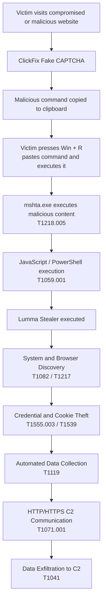

# Week 4 – Cyber Kill Chain Analysis

## Case Study: Lumma Stealer ClickFix Campaign

### Objective

The objective of this report is to analyze a real-world infostealer
campaign using the Lockheed Martin Cyber Kill Chain model and map the
observed attacker behavior to corresponding MITRE ATT&CK tactics and
techniques.

### Selected Case

This report analyzes a Lumma Stealer campaign that used the ClickFix
social engineering technique. Victims were presented with fake CAPTCHA
verification pages and instructed to execute malicious commands on their
Windows systems. These commands initiated a multi-stage infection chain
that ultimately deployed Lumma Stealer.

Lumma Stealer is an information-stealing malware family that has been
active since at least 2022. Its primary purpose is to collect sensitive
information from compromised systems, including browser data,
credentials, cookies, and cryptocurrency-related information.

## Cyber Kill Chain Overview

The Cyber Kill Chain is a cybersecurity model developed by Lockheed Martin to describe the stages an attacker may follow when conducting a cyberattack. It helps security analysts understand how an intrusion develops and identify opportunities to detect or stop the attacker at different stages.

The model consists of seven stages:

1. **Reconnaissance** – The attacker gathers information about the target, such as systems, users, technologies, or possible attack vectors.

2. **Weaponization** – The attacker prepares a malicious payload or combines malware with a delivery mechanism that can be used against the target.

3. **Delivery** – The malicious payload or attack mechanism is delivered to the victim. Common methods include phishing emails, malicious websites, links, and compromised legitimate websites.

4. **Exploitation** – The attacker exploits a vulnerability or uses user interaction to execute malicious code on the victim's system.

5. **Installation** – Malware or another malicious component is installed or established on the compromised system.

6. **Command and Control (C2)** – The compromised system communicates with attacker-controlled infrastructure, allowing the attacker or malware to exchange information and instructions.

7. **Actions on Objectives** – The attacker performs the final objectives of the operation, such as stealing credentials, browser information, session cookies, cryptocurrency data, or other sensitive information.

In this report, the Cyber Kill Chain is used to structure the analysis of the Lumma Stealer ClickFix campaign. MITRE ATT&CK is then used to provide a more detailed description of the tactics and techniques observed during the attack.

## Cyber Kill Chain Analysis

### 1. Reconnaissance

During the reconnaissance stage, attackers normally collect information about potential targets and identify possible ways to reach them.

In the analyzed Lumma Stealer ClickFix campaign, there is no sufficient publicly available evidence describing a dedicated reconnaissance phase against individual victims. Instead, the campaign used a broad opportunistic approach: compromised websites and malicious web content were used to expose visitors to the ClickFix lure.

Because the available reports do not describe specific reconnaissance activities performed before the infection, no MITRE ATT&CK reconnaissance technique is assigned to this stage.

**Cyber Kill Chain stage:** Reconnaissance  
**Observed activity:** No specific reconnaissance activity publicly documented  
**MITRE ATT&CK mapping:** Not assigned

### 2. Weaponization

During the weaponization stage, the attacker prepares the malicious components that will later be delivered to the victim.

In the Lumma Stealer ClickFix campaign, attackers prepared fake CAPTCHA pages and malicious commands designed to convince users to execute the infection chain themselves. The malicious command was copied to the victim's clipboard and was designed to initiate additional malicious content through legitimate Windows utilities.

The campaign also used obfuscation and encoded content to make malicious components more difficult to detect and analyze.

Relevant MITRE ATT&CK techniques include:

- **T1027 – Obfuscated Files or Information:** malicious content and payloads can be obfuscated or encoded to hinder detection and analysis.
- **T1204 – User Execution:** the attack chain is designed around convincing the victim to manually execute a malicious command.
- **T1218.005 – System Binary Proxy Execution: Mshta:** Lumma campaigns have used the legitimate Windows `mshta.exe` utility to execute additional malicious content.

**Cyber Kill Chain stage:** Weaponization  
**Observed activity:** Preparation of the ClickFix fake CAPTCHA, malicious command, obfuscated content, and malware delivery chain  
**MITRE ATT&CK:** T1027, T1204, T1218.005

### 3. Delivery

The Delivery stage describes how the malicious content reaches the victim.

In the analyzed Lumma Stealer campaign, attackers compromised legitimate websites and injected malicious JavaScript into them. When a victim visited one of these websites, the injected JavaScript retrieved additional ClickFix content and displayed a fake CAPTCHA verification page.

The victim was presented with an "I'm not a robot" prompt. After interacting with the fake CAPTCHA, a malicious command was silently copied to the victim's clipboard. The page then instructed the victim to open the Windows Run dialog using `Win + R`, paste the command using `Ctrl + V`, and execute it.

This approach combines compromised web infrastructure with social engineering. Instead of directly executing malware through a software vulnerability, the attacker delivers instructions that convince the victim to start the infection chain manually.

Relevant MITRE ATT&CK technique:

- **T1204 – User Execution:** Lumma Stealer has been distributed through fake CAPTCHA pages that instruct victims to open Windows Run, paste malicious clipboard contents, and execute the command.

**Cyber Kill Chain stage:** Delivery  
**Observed activity:** Compromised website → malicious JavaScript → fake CAPTCHA → malicious command copied to clipboard  
**MITRE ATT&CK:** T1204 – User Execution

### 4. Exploitation / Execution

The Exploitation stage represents the point where the attacker successfully causes malicious code to execute on the victim's system.

In the analyzed ClickFix campaign, the attackers did not primarily rely on exploiting a software vulnerability. Instead, they exploited the user's trust through social engineering.

After interacting with the fake CAPTCHA, the victim was instructed to open the Windows Run dialog, paste the malicious command from the clipboard, and execute it. This action started the malicious execution chain.

The command used the legitimate Windows utility `mshta.exe` to retrieve and execute additional malicious content. Subsequent stages of the attack used PowerShell to download and execute additional code that ultimately resulted in Lumma Stealer running on the victim's system.

Relevant MITRE ATT&CK techniques include:

- **T1204 – User Execution:** the victim is socially engineered into manually executing the malicious command.
- **T1218.005 – System Binary Proxy Execution: Mshta:** `mshta.exe` is abused to execute additional malicious content.
- **T1059.001 – Command and Scripting Interpreter: PowerShell:** PowerShell is used during the execution chain to run commands and retrieve additional malicious components.

**Cyber Kill Chain stage:** Exploitation / Execution  
**Observed activity:** User executes malicious clipboard command → mshta executes additional content → PowerShell executes further stages  
**MITRE ATT&CK:** T1204, T1218.005, T1059.001

### 5. Installation

The Installation stage occurs after malicious code has successfully executed and the malware becomes established on the victim's system.

In the analyzed attack chain, the previous PowerShell stages ultimately download and launch the Lumma Stealer executable. Once Lumma is running, the compromised system can begin performing information-stealing activities.

Lumma Stealer has also been observed creating Windows Registry Run keys to maintain persistence. Registry Run keys allow configured programs to execute automatically when a user logs into Windows.

Relevant MITRE ATT&CK technique:

- **T1547.001 – Boot or Logon Autostart Execution: Registry Run Keys / Startup Folder:** Lumma Stealer has created Registry Run keys under `HKCU\SOFTWARE\Microsoft\Windows\CurrentVersion\Run` to maintain persistence.

**Cyber Kill Chain stage:** Installation  
**Observed activity:** Lumma Stealer is downloaded and executed on the victim system; Lumma variants have also used Registry Run keys for persistence  
**MITRE ATT&CK:** T1547.001 – Registry Run Keys / Startup Folder

### 6. Command and Control (C2)

During the Command and Control stage, malware establishes communication with attacker-controlled infrastructure.

After Lumma Stealer executes on the compromised system, it communicates with its C2 infrastructure. Lumma uses web protocols such as HTTP/HTTPS for this communication.

The C2 infrastructure allows Lumma to retrieve configuration information that specifies what data should be targeted on the infected machine. Lumma can also receive information about additional plugins or malware that should be installed.

Microsoft documented several types of Lumma C2 operations, including:

- **PING / LIFE** – checks whether a C2 server is active.
- **RECEIVE_MESSAGE** – retrieves configuration information containing target specifications.
- **SEND_MESSAGE** – sends collected information back to the C2 infrastructure.
- **GET_MESSAGE** – retrieves information about additional plugins or malware.

Lumma also uses multiple C2 servers and fallback mechanisms to make its infrastructure more resilient. Microsoft observed C2 information being obtained through hardcoded servers as well as fallback mechanisms involving Telegram and Steam profiles. C2 traffic is protected using HTTPS.

Relevant MITRE ATT&CK techniques include:

- **T1071.001 – Application Layer Protocol: Web Protocols:** Lumma uses HTTP/HTTPS for C2 communication.
- **T1573.002 – Encrypted Channel: Asymmetric Cryptography:** Lumma uses HTTPS to protect C2 traffic.

**Cyber Kill Chain stage:** Command and Control  
**Observed activity:** Lumma communicates with C2 servers, retrieves configuration and sends information using HTTP/HTTPS  
**MITRE ATT&CK:** T1071.001, T1573.002

### 7. Actions on Objectives

Actions on Objectives is the final stage of the Cyber Kill Chain. At this stage, the attacker performs the activities that accomplish the main purpose of the attack.

The primary objective of Lumma Stealer is information theft. After execution, Lumma searches the compromised system for valuable information.

Lumma can collect:

- saved browser credentials and passwords;
- browser session cookies;
- browser autofill information;
- cryptocurrency wallets and browser wallet extensions;
- VPN configuration files;
- information from email and FTP clients;
- Telegram application data;
- user documents such as PDF, DOCX, and RTF files;
- system information such as operating system version, CPU information, locale, and installed applications.

The collected information can then be prepared for exfiltration and transmitted to attacker-controlled infrastructure through the existing C2 communication channel.

Relevant MITRE ATT&CK techniques include:

- **T1555.003 – Credentials from Password Stores: Credentials from Web Browsers:** Lumma extracts credentials and other sensitive information stored by web browsers.
- **T1539 – Steal Web Session Cookie:** Lumma collects browser session cookies.
- **T1119 – Automated Collection:** Lumma automatically collects targeted information, including cryptocurrency-related data.
- **T1082 – System Information Discovery:** Lumma collects information about the compromised system.
- **T1041 – Exfiltration Over C2 Channel:** Lumma sends collected information through its existing HTTP/HTTPS C2 communication channels.

**Cyber Kill Chain stage:** Actions on Objectives  
**Observed activity:** Credential theft, cookie theft, cryptocurrency wallet collection, document collection, system profiling, and exfiltration of collected data  
**MITRE ATT&CK:** T1555.003, T1539, T1119, T1082, T1041

## Cyber Kill Chain and MITRE ATT&CK Mapping

The following table summarizes the Lumma Stealer ClickFix attack and maps the observed behavior to relevant MITRE ATT&CK techniques.

| Cyber Kill Chain Stage | Observed Activity | MITRE ATT&CK Technique | Technique ID |
|---|---|---|---|
| Reconnaissance | No specific reconnaissance activity was publicly documented for the analyzed campaign | Not assigned | N/A |
| Weaponization | Preparation of fake CAPTCHA, malicious commands, obfuscated content, and the Lumma delivery chain | Obfuscated Files or Information; User Execution; System Binary Proxy Execution: Mshta | T1027; T1204; T1218.005 |
| Delivery | Compromised websites and malicious JavaScript display the ClickFix fake CAPTCHA and provide the malicious command | User Execution | T1204 |
| Exploitation / Execution | Victim executes the command; mshta and PowerShell execute subsequent malicious stages | User Execution; System Binary Proxy Execution: Mshta; Command and Scripting Interpreter: PowerShell | T1204; T1218.005; T1059.001 |
| Installation | Lumma is downloaded and executed; Lumma variants have used Registry Run keys for persistence | Boot or Logon Autostart Execution: Registry Run Keys / Startup Folder | T1547.001 |
| Command and Control | Lumma communicates with attacker infrastructure using web protocols and encrypted communication | Application Layer Protocol: Web Protocols; Encrypted Channel | T1071.001; T1573.002 |
| Actions on Objectives | Lumma steals browser credentials, cookies, cryptocurrency information, documents and system information, then exfiltrates collected data | Credentials from Web Browsers; Steal Web Session Cookie; Automated Collection; System Information Discovery; Exfiltration Over C2 Channel | T1555.003; T1539; T1119; T1082; T1041 |

## Attack Flow Diagram

The following diagram summarizes the analyzed Lumma Stealer ClickFix infection chain and shows how the attack progresses from initial delivery to information theft and exfiltration.

The attack relies heavily on social engineering rather than exploitation of a traditional software vulnerability. The victim is convinced to execute the initial malicious command, after which multiple execution stages ultimately deploy Lumma Stealer. Lumma then discovers and collects valuable information from the compromised system and sends the stolen data to attacker-controlled infrastructure.

## Conclusion

This case study analyzed the Lumma Stealer ClickFix campaign using the Cyber Kill Chain and MITRE ATT&CK frameworks.

The analysis shows how the attack progresses from malicious web content and social engineering to user execution, malware deployment, command-and-control communication, information collection, and data exfiltration.

The Cyber Kill Chain provides a high-level view of the attack lifecycle, while MITRE ATT&CK provides more detailed information about specific attacker techniques. Important techniques observed in the Lumma attack chain include User Execution (T1204), Mshta (T1218.005), PowerShell (T1059.001), Web Protocols (T1071.001), Credentials from Web Browsers (T1555.003), and Exfiltration Over C2 Channel (T1041).

This analysis demonstrates how threat intelligence frameworks can be used together to describe and understand the behavior of a real-world information-stealing malware campaign.

## References

1. Microsoft Threat Intelligence. *Lumma Stealer: Breaking down the delivery techniques and capabilities of a prolific infostealer.* Microsoft Security Blog, 2025.

2. MITRE ATT&CK. *Lumma Stealer (S1213).*

3. MITRE ATT&CK. *Enterprise Techniques.*

4. Lockheed Martin. *Cyber Kill Chain.*